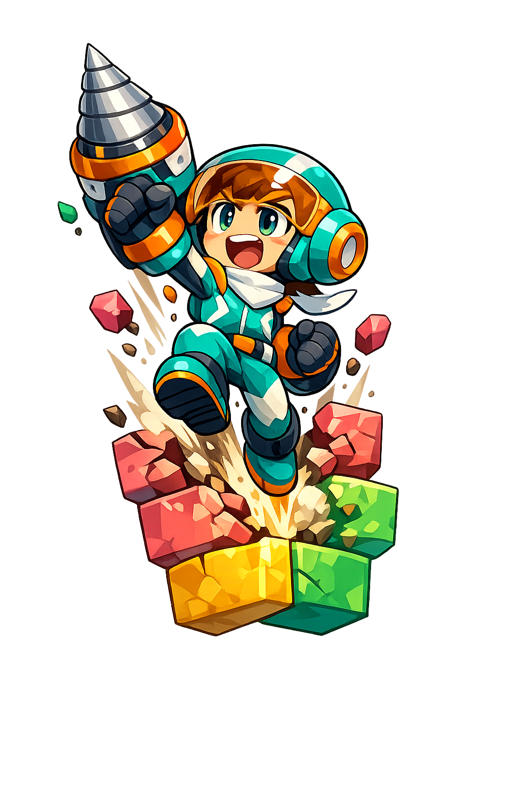

# ミスタードリラーTERM



1999年ナムコ「ミスタードリラー」(初代)のルール・雰囲気に寄せた、ターミナル(TUI)で動く縦穴掘りアクションゲーム。

幅12マス・深さ1000mの縦穴を掘り進み、酸素が尽きる前・落下ブロックに押し潰される前にゴールを目指す。

## 操作方法

| キー | 動作 |
|---|---|
| ←/→ | 移動(掘削を伴う) |
| ↑/↓ | 向きを変える(掘削なし) |
| X/Z | 掘削(向いている方向) |
| Space/P | 一時停止/再開 |
| Q | ゲーム終了 |

岩ブロック(灰色)は掘削不可。迂回して進む必要がある。

## 遊べるモード

| モード | ステータス | 概要 |
|---|---|---|
| ノーマル | 開発中 | 深度1000mを目指す通常プレイ。酸素管理とチェックポイントボーナスがスコアの鍵 |
| タイムアタック | 開発中 | 固定シードで毎回同じ盤面を生成し、クリアタイムの自己ベストを競う |
| ネットワーク対戦 | 開発中 | UDPブロードキャストでLAN内の対戦相手を自動探索し、同一盤面を同時に掘り進んで先に深度500mへ到達した方が勝ち |

各モードの詳細仕様は [docs/spec.md](docs/spec.md) を参照。

## ビルド方法

実装が揃い次第、通常のcargoプロジェクトとしてビルド・実行できるようにする予定。

```sh
cargo run
```

## 使用予定の主なクレート

- `ratatui` / `crossterm` — TUI描画・キー入力
- `rodio` — サウンド(自作波形合成によるSE/BGM。実機音源は使用しない)
- `rand` / `rand_chacha` — 盤面生成用の決定的乱数生成
- `serde` / `bincode` / `uuid` — ネットワーク対戦のプロトコル実装

## ライセンス・その他

詳細な仕様は [docs/spec.md](docs/spec.md) を参照。
