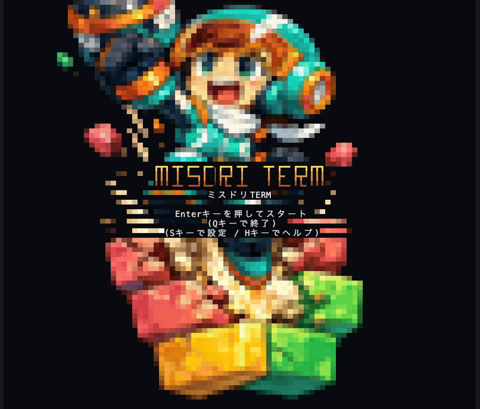

# ミスドリTERM


1999年ナムコ「ミスタードリラー」っぽい、ターミナル(TUI)で動く縦穴掘りアクションゲーム。

穴を掘り進み、酸素が尽きる前・落下ブロックに押し潰される前にゴールを目指す。



> 本プロジェクトは非公式のファンプロジェクトであり、株式会社バンダイナムコエンターテインメントおよび関係各社とは無関係です。

## 操作方法

| キー | 動作 |
|---|---|
| ←/→ | 移動(掘削なし) |
| ↑/↓ | 向きを変える(移動なし) |
| X/Z | 掘削(向いている方向) |
| Space/P | 一時停止/再開 |
| Esc | ゲーム終了/タイトルへ戻る |

岩ブロック(灰色)は掘削不可。迂回して進む必要がある。

## ビルド方法

実装が揃い次第、通常のcargoプロジェクトとしてビルド・実行できるようにする予定。

```sh
cargo run
```

## 使用予定の主なクレート

- `ratatui` / `crossterm` — TUI描画・キー入力
- `rodio` — サウンド(自作波形合成によるSE/BGM。実機音源は使用しない)
- `rand` / `rand_chacha` — 盤面生成用の決定的乱数生成
- `serde` / `bincode` / `uuid` — ネットワーク対戦のプロトコル実装

## ライセンス・その他

詳細な仕様は [docs/spec.md](docs/spec.md) を参照。
